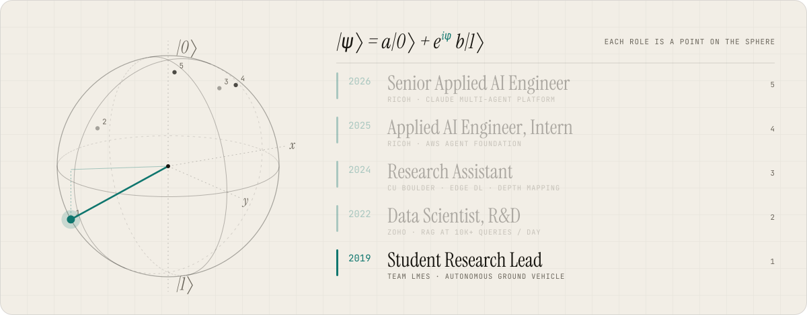
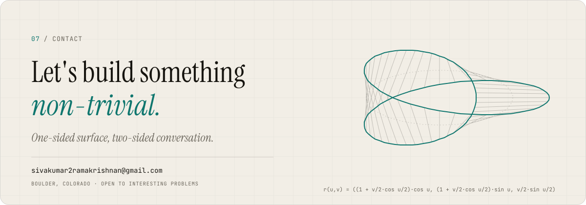

<div align="center">

<picture>
  <source media="(prefers-color-scheme: dark)" srcset="assets/hero-dark.svg">
  
</picture>

<picture>
  <source media="(prefers-color-scheme: dark)" srcset="assets/ket-dark.svg">
  
</picture>

<a href="https://sivakumar-portfolio-omega.vercel.app/"></a>

<a href="https://sivakumar-portfolio-omega.vercel.app/"></a>
<a href="https://www.linkedin.com/in/siva-math/"></a>
<a href="https://huggingface.co/Arsive"></a>


</div>

<picture>
  <source media="(prefers-color-scheme: dark)" srcset="assets/divider-dark.svg">
  
</picture>

<picture>
  <source media="(prefers-color-scheme: dark)" srcset="assets/h01-dark.svg">
  
</picture>

<picture>
  <source media="(prefers-color-scheme: dark)" srcset="assets/fourier-dark.svg">
  
</picture>

I am an applied AI engineer who ships agentic systems end to end, from AWS backends and SQL data models to Claude-powered multi-agent workflows that turn days of manual work into minutes. Before Ricoh I spent two years at ZOHO building a RAG system that handles 10K+ queries a day, and I finished my MS in Data Science at CU Boulder with a 4.0. I enjoy the math behind these systems as much as the products themselves.

```yaml
name:      Sivakumar Ramakrishnan   # シヴァクマール
role:      Senior Applied AI Engineer @ Ricoh
focus:     [multi-agent systems, RAG, LLM eval, NLP, vision, multimodal, quantum]
education:
  - M.S. Data Science, CU Boulder           # 2024–2026 · GPA 4.00
  - B.E. Electronics & Comm., Sri Sai Ram   # 2018–2022 · GPA 3.65
location:  Boulder, Colorado
speaks:    [Tamil, Telugu, English, Hindi, Japanese (JLPT N5), French]
motto:     "Physics is my favourite, math is my queen, Programming since 2018."
mantra:    "You don't need sleep, you need answers."
```

- 🧠 Shipped a **Claude-powered multi-agent platform** at Ricoh: an orchestrator routes each request to a Data Analyst or Service agent
- ⚡ Cut **60 hours of manual work to 40 minutes** with an agentic UI-snapshot harness (130 screens × 7 languages)
- 🔎 Built **RAG at 10K+ queries/day** at ZOHO, with **−20% latency** and **−35% hallucinations**
- 🏆 **1st place on Kaggle** (Goodreads rating prediction, framed as text generation with T5)

<br clear="right"/>

<picture>
  <source media="(prefers-color-scheme: dark)" srcset="assets/divider-dark.svg">
  
</picture>

<picture>
  <source media="(prefers-color-scheme: dark)" srcset="assets/h02-dark.svg">
  
</picture>

| | Project | The math underneath | What it does | Stack |
|:-:|:--|:--|:--|:--|
| 🤖 | **Agentic Service Platform**<br><sub>Ricoh · 2025 → now</sub> | $`a^{*} = \arg\max_{i}\; p(\text{agent}_i \mid q)`$ | A Claude-powered multi-agent platform. An orchestrator routes each request to a Data Analyst agent or a Service agent that helps field technicians fix printers, with images for repair steps. | `Claude` `AWS Lambda` `DynamoDB` `Aurora SQL` |
| 📄 | **Document Pipeline on Ray**<br><sub>Ricoh · 2026</sub> | $`S(n) = \frac{1}{(1-p) + p/n}`$ | A parallel ingestion pipeline on Ray that processes thousands of documents in under an hour. | `Python` `Ray` `S3` |
| 🌐 | **Localized UI Snapshot Harness**<br><sub>Ricoh · 2026</sub> | $`130 \times 7 \to 900^{+}`$ | An agentic harness that captures 130 app screens in each of 7 languages, turning 60 hours of manual work into 40 minutes. | `Claude` `Python` `UI automation` |
| 🔎 | **RAG at Scale**<br><sub>ZOHO · 2023–24</sub> | $`p(y\mid x)=\sum_{z\in\text{top-}k} p_\eta(z\mid x)\,p_\theta(y\mid x,z)`$ | A RAG system on vLLM handling 10K+ queries a day. Hybrid retrieval with reranker fusion cut latency by 20% and hallucinations by 35%. | `vLLM` `PyTorch` `FastAPI` `Redis` `PostgreSQL` |
| 📐 | **KL Divergence: A Statistical Bridge**<br><sub>CU Boulder · 2024</sub><br>[code](https://github.com/Arsive02/KL_divergence_statistics) · [demo](https://kl-divergence-statistics.vercel.app) | $`D_{\mathrm{KL}}(P \Vert Q)=\sum_x P(x)\log\frac{P(x)}{Q(x)}`$ | Showing with real models that maximum likelihood and KL minimisation are the same thing. Logistic regression, random forests, neural nets and VAEs, all visualised live. | `PyTorch` `scikit-learn` `React` |
| ✨ | **Stellar Mapping**<br><sub>CU Boulder · 2024</sub><br>[code](https://github.com/rahul7310/stellar_mapping) · [demo](https://stellarmapping.vercel.app/) | $`A\mathbf{v} = \lambda \mathbf{v}`$ | Finding constellations in night-sky photos with an ensemble of a CNN, a Vision Transformer and EfficientNet. It holds up under light pollution and rotation. | `PyTorch` `ViT` `EfficientNet` |
| 🐍 | **Mamba × Transformer Hybrid**<br><sub>ZOHO · 2024</sub> | $`h_t=\bar A h_{t-1}+\bar B x_t,\; y_t=C h_t`$ | Mamba handles long-range memory and attention handles focus. I tried running them side by side, one after the other, and with a learned switch between them. | `PyTorch` `Mamba SSM` `JAX` `W&B` |
| 🏆 | **Goodreads Rating Prediction: 1st place**<br><sub>Kaggle · 2023</sub><br>[code](https://github.com/Arsive02/Goodreads_Books_Review_Rating_Prediction) · [board](https://www.kaggle.com/competitions/goodreads-books-reviews-290312/leaderboard) | $`H(X) = -\sum p \log p`$ | Won a Kaggle competition by treating rating prediction as a text generation problem. A fine-tuned T5 reached 0.70 mean F1. | `T5` `Transformers` `PyTorch` |

<details>
<summary><b>More from the archive</b>: 7 projects</summary>
<br>

| Project | What it does | Links | Stack |
|:--|:--|:-:|:--|
| **Invoice → JSON with PaliGemma** | A fine-tuned PaliGemma that reads invoices in 200+ layouts and returns clean, validated JSON, with 88% of fields correct. | [🤗 model](https://huggingface.co/Arsive/paligemma-img-to-json) | `PaliGemma` `PyTorch` `FastAPI` |
| **RLHF with DPO** | Compares Direct Preference Optimisation with classic RLHF on a real RAG system, looking at training stability, convergence speed and answer quality. | — | `Transformers` `Ray` `W&B` |
| **RoBERTa Toxicity Classifier** | Flags hate, obscenity, threats and insults in text, tuned to avoid false alarms in real moderation work. | [🤗 model](https://huggingface.co/Arsive/roberta-toxicity-classifier) | `PyTorch` `Hugging Face` |
| **Resume Parser with OCR** | An OCR + NER pipeline that extracts and normalises entities and ambiguous dates from any resume format. | — | `Surya OCR` `spaCy` `Flask` |
| **Multimodal AI System** | Speech, text, images and video in one system, used for meeting summaries, scene detection and search across formats. | — | `Whisper` `CLIP` `TimeSformer` |
| **Edge AIoT Inspection** | A full-stack inspection system that spots defective microchips in real time with 92% accuracy. | [video](https://www.youtube.com/watch?v=mOJEEJ-eYmM) | `TensorFlow` `OpenCV` `DynamoDB` `Raspberry Pi` |
| **Autonomous Ground Vehicle** | A small robot that follows lanes, dodges obstacles with YOLOv4 and plans its own path on a Jetson Nano. | [code](https://github.com/Balaji-th/Autonomous_Vehicle) · [video](https://youtu.be/48irckF3vA0) | `YOLOv4` `ROS` `Jetson Nano` |

</details>

<picture>
  <source media="(prefers-color-scheme: dark)" srcset="assets/divider-dark.svg">
  
</picture>

<picture>
  <source media="(prefers-color-scheme: dark)" srcset="assets/h03-dark.svg">
  
</picture>

<picture>
  <source media="(prefers-color-scheme: dark)" srcset="assets/bloch-dark.svg">
  
</picture>

<details open>
<summary><b>Senior Applied AI Engineer · Ricoh</b> <sub>Apr 2026 → present · Boulder, CO</sub></summary>

- Architected and shipped a **Claude-powered multi-agent platform**: an orchestrator routes each request to a Data Analyst agent or a Service agent that pulls maintenance documentation to help field technicians fix printers
- Added **image support** to the Service agent, so repair steps come with the matching procedural illustrations
- Built a **document pipeline on Ray** that processes thousands of documents in under an hour
- Automated localized UI screenshots with an **agentic harness**: 130 screens × 7 languages (900+ images), cutting **60 hours to 40 minutes**

</details>

<details>
<summary><b>Applied AI Engineer (Intern) · Ricoh</b> <sub>May 2025 – Apr 2026</sub></summary>

- Led the first deployment of the Service agent, with human feedback loops, conversational memory, and tool calls to JIRA and Redmine through AWS connectors
- Designed the shared AWS foundation (Lambda, DynamoDB, S3, Aurora SQL) that later agents are built on

</details>

<details>
<summary><b>University of Colorado Boulder</b>: course assistant, research, quantum computing <sub>2024 – 2026</sub></summary>

- **Course Assistant, Statistical Methods & Applications II** (STAT 4010/5010, Jan – Apr 2026)
- **Course Assistant, Statistical Methods & Applications I** (STAT 4000/5000, Aug – Dec 2025): assessment, feedback and consistent grading for undergraduate and graduate students
- **Quantum Computing Research Group** (volunteer, Feb – Apr 2025): fundamentals of quantum computing and quantum algorithms
- **Research Assistant** (Sep – Oct 2024): deep-learning architectures optimised for edge devices, and depth mapping for aerial imagery ([research areas](https://praisecu.github.io/research-areas))

</details>

<details>
<summary><b>Data Scientist, R&amp;D · ZOHO</b> <sub>May 2022 – Jul 2024 · Chennai (trainee and intern from 2021)</sub></summary>

- Architected a **RAG system serving 10K+ queries a day**, cutting response latency by 20% and hallucinations by 35% with hybrid retriever and reranker fusion on vLLM
- Built customer-assistance AI with PyTorch and Transformers: predicting which kind of help a customer needs from their support conversation, phishing detection at 90% accuracy, and a resume parser handling 2K+ resumes a month
- Root-cause analysis of negative customer email threads to find what drives churn
- Generative features for FAQ generation, reply drafting and summarisation; foundational multimodal research; mentored interns into full-time hires

</details>

<details>
<summary><b>Beyond the job</b></summary>

- **President, Indian Classical Music Society, CU Boulder** (Dec 2024 → present): founded the first recognised society for Indian classical music at CU Boulder and grew it from 3 to 20+ members
- **Student Research Lead, Team LMES** (2019–2022): autonomous ground vehicle with lane and object detection on a Raspberry Pi and Jetson Nano
- **Intern, Siemens Healthineers** (2021): prototyped a CNN to flag abnormal CT scans for faster radiologist review
- **Intern, MIT Square** (2020): smart water purifier project with a data-driven chatbot

</details>

> *"He quickly became our go-to person for anything related to NLP research and development, especially in areas like Retrieval-Augmented Generation (RAG) and Generative Large Language Models (LLMs)."*
>
> <sub>Arul Vendhan, NLP Engineer at Zoho, who managed Siva directly · <a href="https://www.linkedin.com/in/siva-math/details/recommendations/">LinkedIn recommendation</a></sub>

<picture>
  <source media="(prefers-color-scheme: dark)" srcset="assets/divider-dark.svg">
  
</picture>

<picture>
  <source media="(prefers-color-scheme: dark)" srcset="assets/h04-dark.svg">
  
</picture>

<picture>
  <source media="(prefers-color-scheme: dark)" srcset="assets/attention-dark.svg">
  
</picture>

<picture>
  <source media="(prefers-color-scheme: dark)" srcset="assets/marquee-dark.svg">
  
</picture>

<div align="center">


</div>

<picture>
  <source media="(prefers-color-scheme: dark)" srcset="assets/divider-dark.svg">
  
</picture>

<picture>
  <source media="(prefers-color-scheme: dark)" srcset="assets/h05-dark.svg">
  
</picture>

| | Award | Where | Year |
|:-:|:--|:--|:-:|
| 🥇 | **1st place**, Kaggle Goodreads rating prediction · [leaderboard](https://www.kaggle.com/competitions/goodreads-books-reviews-290312/leaderboard) | Kaggle | 2023 |
| 🥈 | **2nd place**, National Mathematics Conference | SRM Institute of Science and Technology | 2018 |
| 🥉 | **3rd place**, national paper presentation on AIoT | Prince Shri Bhavani College of Engineering | 2021 |
| 🎓 | **Academic Excellence Award** | Sri Sai Ram Engineering College, Anna University | 2019 |
| 📜 | **Merit Scholarship** | Sembakkam Municipality | 2018 |

<details>
<summary><b>Certifications</b>: 10</summary>
<br>

- [Natural Language Processing Specialization](https://www.coursera.org/account/accomplishments/specialization/JFDNHB4YM3AR), DeepLearning.AI · Stanford, 2022
- [Deep Learning Specialization](https://www.coursera.org/account/accomplishments/specialization/DEVTH7W95X9T), DeepLearning.AI, 2022
- [Machine Learning](https://www.coursera.org/account/accomplishments/verify/Q7G4VB62HQBK), Stanford · Andrew Ng, 2022
- [Image Super-Resolution with Autoencoders](https://www.coursera.org/account/accomplishments/verify/224HMQYX5MP6), Coursera, 2020
- [Image Classification with TensorFlow](https://www.coursera.org/account/accomplishments/verify/W2HZ4BZDQ54H), Coursera, 2020
- [Problem Solving](https://www.hackerrank.com/certificates/3C2D7E87403C) and [Python](https://www.hackerrank.com/certificates/8ED97EAC7704), HackerRank, 2021
- [Programming with MATLAB](https://www.coursera.org/account/accomplishments/verify/LGLX4PLXAGQG), Vanderbilt University, 2020
- [Git and GitHub](https://www.coursera.org/account/accomplishments/verify/EKH2UNG5RWNG), Google, 2020
- JLPT N5 in Japanese, The Japan Foundation, 2019

</details>

<picture>
  <source media="(prefers-color-scheme: dark)" srcset="assets/divider-dark.svg">
  
</picture>

<picture>
  <source media="(prefers-color-scheme: dark)" srcset="assets/h06-dark.svg">
  
</picture>

<picture>
  <source media="(prefers-color-scheme: dark)" srcset="https://raw.githubusercontent.com/Arsive02/Arsive02/output/activity-dark.svg">
  
</picture>

<picture>
  <source media="(prefers-color-scheme: dark)" srcset="assets/contact-dark.svg">
  
</picture>

<div align="center">

[](https://sivakumar-portfolio-omega.vercel.app/)
[](https://www.linkedin.com/in/siva-math/)
[](mailto:sivakumar2ramakrishnan@gmail.com)
[](https://www.kaggle.com/arsiveai)
[](https://huggingface.co/Arsive)
[](https://lichess.org/@/Arsive02)
[](https://leetcode.com/sivaparkour2/)
[](https://dev.to/arsive02)
[](https://stackoverflow.com/users/12125576/arsive)

<sub><i>Every animation on this page is a hand-built SVG (CSS keyframes + SMIL, text set as paths from Instrument Serif and JetBrains Mono), in the style of my v3 portfolio. It respects <code>prefers-reduced-motion</code>.</i></sub>

</div>
